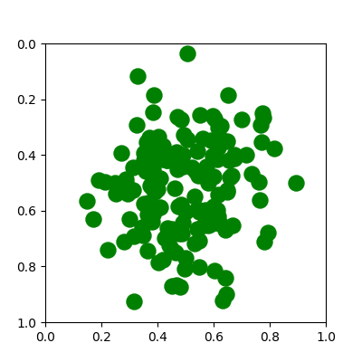

# SetXAI
Los Deep Sets o conjuntos profundos son estructuras de datos aprendidas que son invariantes al orden de los elementos (permutation invariance) y al número de los mismos (variable size). Esto los hace suficientemente generales para tratar problemas como el reconocimiento de sub-conjuntos de tramas de video, clasificación y segmentación de nubes de puntos, clasificación y regresión de embeddings, etc.
En este repositorio lo que trataremos de hacer será un framework de fácil uso para tratar la explicabilidad de estas arquitecturas invariantes a la permutación y equivariantes a la permutación.

    

